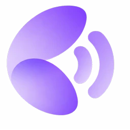
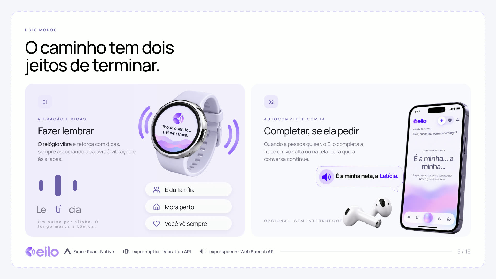
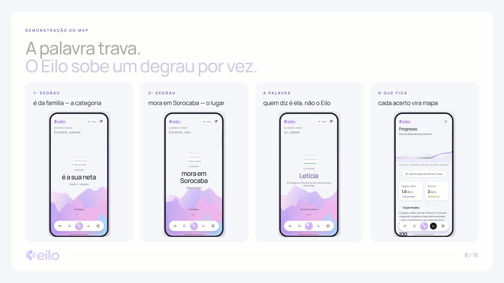
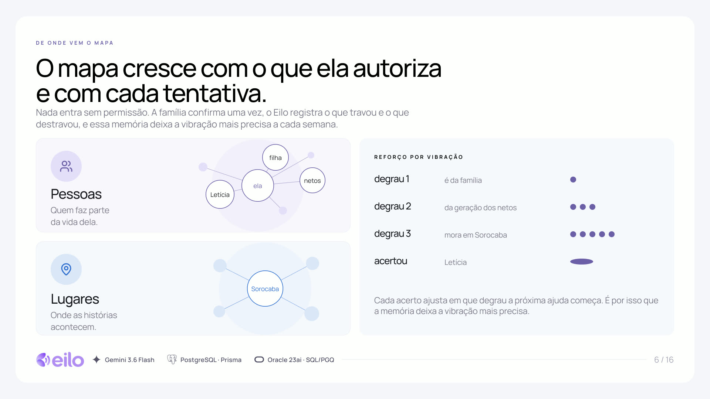
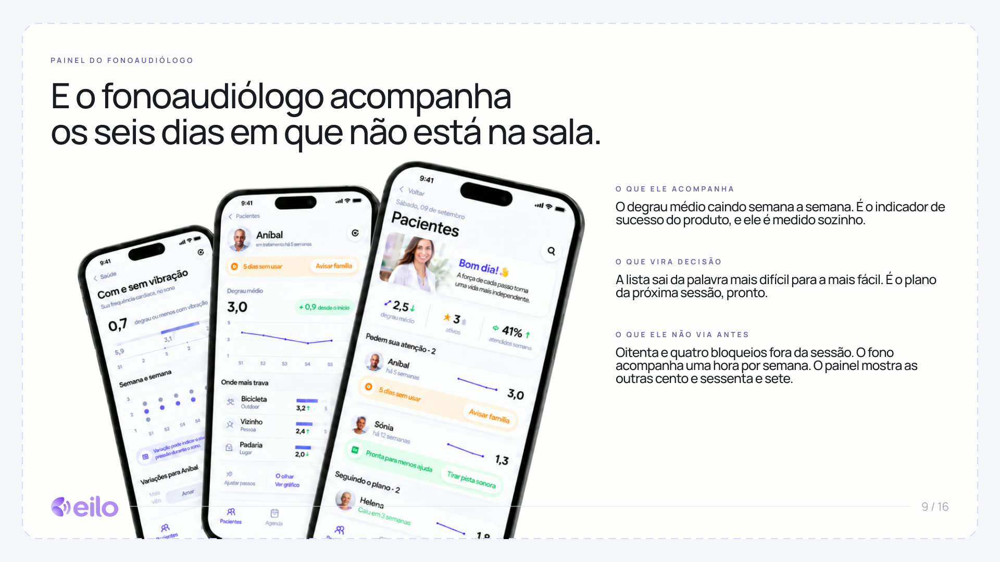
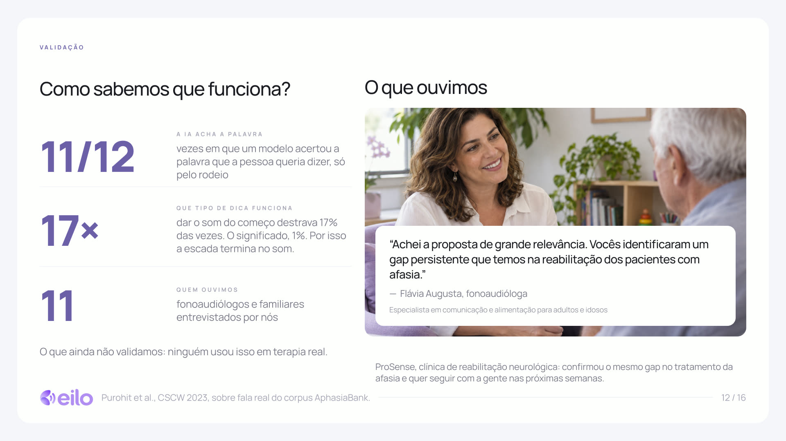

<a id="readme-top"></a>

<!-- PROJECT LOGO -->
<br />
<div align="center">
  <a href="https://github.com/Kc1t/tech4change-2026">
    
  </a>

  <h1 align="center">Eilo</h1>

  <p align="center">
    O caminho até a palavra. Para quem teve AVC e ficou com anomia, o Eilo devolve <strong>a rota</strong> até o nome que travou — pistas que sobem em degraus, tiradas do <strong>mapa da vida da própria pessoa</strong>, no segundo da conversa em que a palavra falta.
    <br />
    <a href="docs/ARQUITETURA.md"><strong>📄 Documentação técnica</strong></a>
    ·
    <a href="https://www.youtube.com/watch?v=uXWnjCYHHWE" target="_blank"><strong>🎥 Vídeo do pitch</strong></a>
  </p>

  <p align="center">
    <a href="https://eilo.kc1t.com" target="_blank"><strong>🌐 Testar o MVP — eilo.kc1t.com »</strong></a>
  </p>

  <p align="center">
    
    
    
    
    
    
  </p>
</div>

> [!IMPORTANT]
> Entrega do **Tech4Change 2026 — FIAP PosTech**, tema *Potencializando o ser humano com Inteligência Artificial*. Protótipo acadêmico: **não é dispositivo médico**, não substitui fonoaudiologia e nunca foi usado em terapia real. A persona da demonstração é fictícia.

<div align="center">
  <a href="https://www.youtube.com/watch?v=uXWnjCYHHWE" target="_blank">
    
  </a>
  <br />
  <sub><a href="https://www.youtube.com/watch?v=uXWnjCYHHWE"><strong>▶ Assistir ao pitch — 4 min</strong></a></sub>
</div>

<p align="center">
  <strong>700 mil</strong> brasileiros com afasia · <strong>4</strong> degraus até a palavra · <strong>11</strong> profissionais e familiares ouvidos · <strong>0</strong> palavras saindo do aparelho
</p>

> [!TIP]
> **Teste em menos de um minuto, sem instalar nada.** Abra **[eilo.kc1t.com](https://eilo.kc1t.com)** no celular, toque em *Ver com um exemplo pronto* e experimente travar numa palavra — a escada de dicas aparece no mesmo quadro do toque, sem rede e sem chave de API. &nbsp;·&nbsp; 🎥 **[Assista ao pitch de 4 min](https://www.youtube.com/watch?v=uXWnjCYHHWE)**

## Resumo para avaliação

O Eilo não é um app de exercícios de fonoaudiologia nem um assistente que responde quando chamado. É o único que age **no segundo em que a palavra trava, dentro da conversa** — e que trabalha para deixar de ser necessário.

- **Conceito próprio:** a dica é a história da pessoa, não um dicionário. A anomia trava quase sempre em *nome próprio* — a neta, a cidade, o cachorro — exatamente o que nenhum modelo de linguagem sabe, porque nunca esteve na internet.
- **IA onde ela resolve:** o modelo não escreve a dica, ele **ordena candidatos do grafo e devolve só identificadores**. Cada degrau precisa citar uma aresta que existe; se falhar, a resposta inteira é rejeitada.
- **Privacidade estrutural, não promessa:** o backend recebe uma projeção opaca do grafo. O schema de entrada **recusa** nome próprio — uma requisição com um rótulo volta `400`.
- **A métrica é o recuo:** o indicador de sucesso é o **degrau médio caindo** semana a semana, não o uso subindo. É uma ferramenta desenhada para ser abandonada.
- **Validação com quem trata:** 11 fonoaudiólogos e familiares entrevistados, e a clínica **ProSense** confirmou o mesmo gap e quer seguir conosco.
- **Funciona sem rede e sem IA:** sem `ANTHROPIC_API_KEY` o produto inteiro continua de pé pela escada determinística — e isso tem teste automatizado.

<!-- TABLE OF CONTENTS -->
<details>
  <summary>Índice</summary>
  <ol>
    <li><a href="#resumo-para-avaliação">Resumo para avaliação</a></li>
    <li>
      <a href="#sobre-o-projeto">Sobre o projeto</a>
      <ul>
        <li><a href="#os-dois-modos">Os dois modos</a></li>
        <li><a href="#de-onde-vem-a-dica">De onde vem a dica</a></li>
      </ul>
    </li>
    <li><a href="#funcionalidades">Funcionalidades</a></li>
    <li><a href="#construído-com">Construído com</a></li>
    <li><a href="#arquitetura--o-motor-de-dica">Arquitetura — o motor de dica</a></li>
    <li><a href="#aderência-ao-desafio">Aderência ao desafio</a></li>
    <li>
      <a href="#começando">Começando</a>
      <ul>
        <li><a href="#pré-requisitos">Pré-requisitos</a></li>
        <li><a href="#instalação">Instalação</a></li>
      </ul>
    </li>
    <li><a href="#aplicações">Aplicações</a></li>
    <li><a href="#roadmap">Roadmap</a></li>
    <li><a href="#privacidade-e-conformidade">Privacidade e conformidade</a></li>
    <li><a href="#licença">Licença</a></li>
    <li><a href="#equipe">Equipe</a></li>
    <li><a href="#contato">Contato</a></li>
  </ol>
</details>

## Sobre o projeto

Depois de um AVC, cerca de 3 em cada 10 sobreviventes ficam com afasia. O quadro mais comum é a **anomia**: não é perda de memória, é perda de acesso. O conteúdo continua inteiro; a via até ele é que se rompeu. A pessoa reconhece quem está na frente dela, sabe o que quer dizer, e o nome não vem.

No dia a dia a palavra que falta quase nunca é "maçã". É o nome da neta, a rua de casa, o rosto na frente dela — e é aí que o tratamento de consultório não alcança, porque ninguém tem um fonoaudiólogo na sala às três da tarde de um domingo.

O Eilo monta um **mapa da vida** da pessoa a partir do que já existe no celular dela — pessoas, lugares, objetos e histórias, ligados entre si — e a família confirma cada ligação. Quando a palavra trava, o relógio vibra e o sistema **não entrega a resposta**: entrega pistas que sobem em degraus, do geral para o específico, até a própria pessoa dizer.

```
é da família  →  da geração dos netos  →  mora em Sorocaba  →  Le…  →  Letícia
```

O nome vem de *ei-lo*: **aqui está**.

### Os dois modos

<div id="os-dois-modos"></div>

- **🫱 Fazer lembrar** — o relógio vibra e vai dando pistas cada vez mais próximas, até a palavra sair da boca dela. É o modo padrão, e é o que gera aprendizado.
- **🗣️ Completar, se ela pedir** — quando continuar tentando já atrapalha a conversa, o Eilo fala a palavra, no fone ou na tela. É saída de emergência, não atalho.

<div align="center">
  
</div>

> Dar pista em hierarquia não é invenção nossa: está descrito na fonoaudiologia desde 1977, no trabalho de Love e Webb, e sempre dependeu de um terapeuta na sala para decidir a hora. O que muda aqui é **quem decide a hora**. E o motivo de não entregar a palavra pronta também está medido: prática de recuperação retém mais do que receber a resposta (Middleton et al., 2015).

### De onde vem a dica

<div id="de-onde-vem-a-dica"></div>

| Camada | O que fornece | No que o Eilo transforma |
|---|---|---|
| **Grafo da vida** (no aparelho) | pessoas, lugares, objetos, histórias e as arestas confirmadas pela família | o universo de candidatos e o texto de cada degrau |
| **Modelo de linguagem** (no backend) | ordenação dos candidatos a partir do rodeio que a pessoa está fazendo | qual pista devolver agora, e em que degrau começar |
| **Aparelhos** (pulso, fone, tela) | vibração, voz e o campo de aurora que ondula com o microfone | o canal certo para o grau de discrição que ela escolheu |

O valor está na divisão: **o grafo sabe o que o modelo não pode saber**, e o modelo escolhe o caminho que o grafo sozinho não saberia priorizar.

<p align="right">(<a href="#readme-top">Voltar ao topo</a>)</p>

## Funcionalidades

<!-- A escada de dicas -->
<table width="100%">
<tr>
<td>

<h3>🪜 A escada de dicas, no momento em que trava</h3>

<p>A pessoa toca uma vez e a escada sobe um degrau por vez — <strong>categoria → lugar → sílaba → a palavra</strong>. A primeira lista vai para a tela <strong>antes de qualquer chamada de rede</strong>, com alvo de 300 ms. Quem diz a palavra é sempre ela.</p>

<div align="center">
  
</div>

</td>
</tr>
</table>

<!-- O mapa da vida -->
<table width="100%">
<tr>
<td>

<h3>🕸️ O mapa da vida, montado do que já existe no celular</h3>

<p>A ingestão roda <strong>offline</strong>: visão computacional detecta e agrupa rostos, Whisper transcreve os áudios da família, o EXIF dá lugar e data. Nada disso vira grafo sozinho — <strong>a família confirma cada identidade e cada relação</strong> na tela de Revisão, e cada ligação guarda de onde veio (foto, áudio, conversa ou confirmação).</p>

<div align="center">
  
</div>

</td>
</tr>
</table>

<!-- Painel do fonoaudiólogo + validação -->
<table width="100%">
<tr>
<td colspan="2">

<h3>📊 Painel do fonoaudiólogo · 🔬 validação com quem trata</h3>

<p>O profissional acompanha os seis dias da semana em que <em>não</em> está na sala: <strong>degrau médio por semana e por alvo</strong>, quais palavras ficaram mais fáceis, e o que fazer na próxima sessão. O indicador de sucesso do produto é esse número <strong>caindo</strong>.</p>

</td>
</tr>
<tr>
<td width="50%" valign="top"></td>
<td width="50%" valign="top"></td>
</tr>
<tr>
<td colspan="2">

<ul>
  <li><strong>11/12</strong> — vezes em que um modelo acertou a palavra que a pessoa queria dizer, só pelo rodeio.</li>
  <li><strong>17×</strong> — dar o som do começo destrava 17% das vezes; o significado, 1%. Por isso a escada termina no som.</li>
  <li><strong>11</strong> fonoaudiólogos e familiares entrevistados, e a clínica <strong>ProSense</strong> confirmou o mesmo gap.</li>
</ul>

</td>
</tr>
</table>

<p align="right">(<a href="#readme-top">Voltar ao topo</a>)</p>

## Construído com

- **Aplicativo web:** Next.js 16 (App Router, Turbopack) · React 19 · TypeScript · Zustand · Tailwind CSS v4 sobre tokens próprios · shadcn/ui e Base UI · PWA com service worker
- **Aplicativo de celular:** React Native 0.86 via Expo SDK 57 · Reanimated 4 · `react-native-svg` · `expo-haptics` (vibração) · `expo-speech` (voz)
- **Backend:** NestJS 11 · Prisma · PostgreSQL · Zod nos contratos de entrada · Swagger · Server-Sent Events
- **Canais do aparelho:** Vibration API · Web Speech API (`SpeechSynthesis` e `SpeechRecognition`, pt-BR) · Web Audio (`AnalyserNode`) para detectar a pausa da fala · Notification API com espelhamento para Wear OS
- **Camada de modelo:** chamada só pelo backend, com tempo limite de 2,5 s e endpoint configurável por `MODEL_BASE_URL` — roda com Gemini, Anthropic ou qualquer provedor compatível, sem mudar código
- **Ingestão do grafo:** Python · InsightFace (detecção e embedding de rostos) · agrupamento não supervisionado (HDBSCAN quando instalado, senão aglomerativo por cosseno em numpy) · Whisper (transcrição pt-BR) · Pillow/EXIF · separação silábica de pt-BR por regras
- **Relógio:** Kotlin para Wear OS, cliente direto da mesma API
- **Publicação:** Vercel (aplicativo e landing) · Railway (backend)

<p align="right">(<a href="#readme-top">Voltar ao topo</a>)</p>

## Arquitetura — o motor de dica

O motor tem quatro etapas. **Só a segunda usa modelo.**

```
        toque na tela  /  pausa detectada no microfone
                          ▼
[web] 1. candidatos  ── propagação de ativação no grafo, local, alvo 300 ms
                          │  a primeira escada já vai para a tela aqui
                          ▼
[api] 2. reordenação ── modelo recebe o recorte e devolve SÓ identificadores
                          ▼
[api] 3. validação   ── cada degrau tem de citar uma aresta existente
                          │  degrau inválido → resposta inteira rejeitada
                          ▼
[web] 4. montagem    ── o texto do degrau sai do grafo, não do modelo
                          ▼
     vibração no pulso · voz no fone · palavra na tela
```

**O que isso garante, na ordem:**

1. **Candidatos** — propagação de ativação no grafo, casamento textual e prior de recência. Local, sem rede. A primeira lista vai para a tela antes de qualquer chamada.
2. **Reordenação** — o modelo recebe o recorte de candidatos e devolve **apenas identificadores** de nó e de aresta. Nunca texto livre. Nunca um nome próprio, nem na ida nem na volta.
3. **Validação** — cada degrau precisa citar uma aresta existente que conecte o nó alvo. **O sistema não consegue inventar uma parente:** um degrau inválido derruba a resposta inteira e cai na escada determinística.
4. **Montagem** — o texto de cada degrau sai do grafo. A pista sonora é recorte de string sobre a separação silábica e **nunca passa pelo modelo**.

**Portão de confiança.** A pista sonora só é emitida acima de `PHONOLOGICAL_CONFIDENCE_GATE`. Abaixo dele a escada para no degrau semântico: errar no semântico é barato e reversível, mas pista fonêmica errada pode induzir perseveração e bloquear o alvo correto.

**Caminho de segurança.** Validação falhou, modelo demorou, ou não há chave: cai na escada determinística montada dos atributos do nó. Não existe estado de erro visível — e o produto inteiro funciona sem nenhuma chave de API.

**Onde os dados ficam.** PostgreSQL via Prisma guarda três tabelas — `AuditEvent`, `CuePlanCache` e `ConsentRecord` — e **nenhuma delas guarda palavra**: o alvo é sempre identificador opaco. O grafo é um JSON versionado no aparelho e o estado de aprendizado fica em `localStorage`. O backend opera degradado, em memória, se o banco cair.

> 📄 **Mais fundo:** [`docs/ARQUITETURA.md`](docs/ARQUITETURA.md) detalha cada etapa do motor, os contratos entre as aplicações, o modelo de dados, a ingestão do grafo e — na seção 10 — o que ainda não está de pé.

<p align="right">(<a href="#readme-top">Voltar ao topo</a>)</p>

## Aderência ao desafio

Como o Eilo responde a cada item do Tech4Change 2026:

| Critério | Como o Eilo responde |
|---|---|
| **Problema e contexto** | Anomia pós-AVC: 700 mil brasileiros vivendo com afasia, até 940 novos AVCs por dia, 3 em cada 10 saindo com afasia. O tratamento existe, mas a evolução depende do dia a dia — onde não há terapeuta. |
| **Público-alvo** | Começa na afasia pós-AVC, com expansão possível para outros quadros de acesso à palavra (Alzheimer inicial, TCE, Parkinson, fala atípica). |
| **Solução e proposta de valor** | Não devolvemos a palavra, devolvemos o caminho até ela. A ajuda chega no segundo do bloqueio, dentro da conversa, e recua conforme a pessoa melhora. |
| **MVP** | Funcional e público em [eilo.kc1t.com](https://eilo.kc1t.com) — escada de dicas, grafo, painel clínico, consentimento, pareamento com o relógio. Demonstrado no vídeo em celular e Galaxy Watch reais. |
| **Tecnologias** | Next 16 · React 19 · NestJS 11 · Prisma/PostgreSQL · Expo/React Native · Python (visão computacional, ML não supervisionado, Whisper) · modelo de linguagem com endpoint configurável. |
| **Modelo de negócio** | Quem assina é o fonoaudiólogo e ele traz os pacientes dele: R$ 119/mês profissional, R$ 59/mês família, parceria com clínicas. 61.054 fonoaudiólogos registrados no CFFa, 88% autônomos — decidem a compra sozinhos. |
| **Validação** | 11 fonoaudiólogos e familiares entrevistados; ProSense confirmou o gap e quer seguir. 11/12 de acerto do modelo só pelo rodeio; 17× de vantagem da pista fonológica sobre a semântica. |
| **Diferenciais e inovação** | A dica é a história dela, não um dicionário · o sistema não pode inventar uma parente · a palavra nunca sai do aparelho · recuar é o objetivo declarado · nunca espera a rede. |
| **Impactos esperados** | Menos degraus para chegar à palavra, mais autonomia, mais conversa real — e o produto se aproximando de deixar de ser necessário. |
| **Próximos passos** | Piloto de quatro semanas com uma clínica de fonoaudiologia, medindo quantos degraus a pessoa precisa até chegar na palavra. |

<p align="right">(<a href="#readme-top">Voltar ao topo</a>)</p>

## Começando

Quatro aplicações independentes, **sem monorepo**. Cada uma tem seu `package.json`, seu `node_modules` e seu deploy. A raiz não tem `package.json` — rode cada uma do seu próprio diretório.

### Pré-requisitos

<div id="pré-requisitos"></div>

- Node.js 20+
- PostgreSQL (o backend sobe degradado, em memória, sem ele)
- Python 3.11+ apenas para o pipeline de ingestão
- Android Studio e o SDK do Wear OS apenas para compilar o relógio

### Instalação

<div id="instalação"></div>

```bash
# 1) API
cd server
npm install                      # o postinstall roda `prisma generate`
cp .env.example .env             # DATABASE_URL e, se quiser IA, a chave do modelo
npm run db:migrate               # aplica as migrações num banco novo
npm run dev                      # http://localhost:3333  ·  contratos em /v1/docs

# 2) Aplicativo web (outro terminal)
cd web
npm install
npm run dev                      # http://localhost:3010

# 3) Landing
cd landing && npm install && npm run dev        # http://localhost:5174

# 4) Celular
cd mobile && npm install && npx expo start      # Expo Go, ou --web

# 5) Ingestão do grafo (opcional, roda offline)
cd ingest
pip install -r requirements.txt
python ingest.py --input input/ --owner Helena  # escreve web/src/data/graph.json
```

> Sem chave de modelo o produto inteiro continua funcionando pela escada determinística — e isso tem teste automatizado em `server/test`.

<p align="right">(<a href="#readme-top">Voltar ao topo</a>)</p>

## Aplicações

| Aplicação | Stack | Porta | Situação |
|---|---|---|---|
| [`web/`](web) | Next 16 · React 19 · Zustand · Tailwind v4 · PWA | 3010 | alvo principal |
| [`server/`](server) | NestJS 11 · Prisma · PostgreSQL · Zod · SSE | 3333 | ativo |
| [`mobile/`](mobile) | React Native 0.86 · Expo SDK 57 · `expo-haptics` · `expo-speech` | 8081 | ativo |
| [`landing/`](landing) | Next 16 · React 19 · Tailwind v4 · Radix | 5174 | ativo |
| [`ingest/`](ingest) | Python · InsightFace · Whisper · EXIF | — | roda offline |
| [`watch/`](watch) | Kotlin · Wear OS | — | **prova de conceito, nunca compilada** |

```text
app/
├─ web/       # aplicativo Next — o alvo principal
├─ server/    # API NestJS — candidatos → modelo → validação → cache
├─ mobile/    # React Native, celular de verdade
├─ landing/   # página pública
├─ watch/     # prova de conceito Wear OS em Kotlin
├─ ingest/    # pipeline Python de ingestão, offline
└─ docs/      # documentação técnica, imagens e os PDFs da entrega
```

`web/src/domain/` e `mobile/src/domain/` são o **mesmo código**, copiado sem adaptação — só tem import relativo, nenhuma dependência de plataforma. O motor de dica é idêntico nos dois.

<p align="right">(<a href="#readme-top">Voltar ao topo</a>)</p>

## Roadmap

- [x] Grafo da vida com proveniência por ligação e tela de revisão pela família
- [x] Motor de dica em quatro etapas, com validação por aresta e caminho determinístico
- [x] Projeção opaca — o backend recusa nome próprio com `400`
- [x] Escada de vibração no pulso, voz no fone e palavra na tela
- [x] Painel do fonoaudiólogo com degrau médio por semana e por alvo
- [x] Consentimento pela própria pessoa, com pictogramas e áudio
- [x] Pareamento entre celular e relógio por código de quatro dígitos, com SSE
- [x] Pipeline de ingestão offline — rostos, áudios, EXIF, separação silábica
- [x] MVP público em [eilo.kc1t.com](https://eilo.kc1t.com) e vídeo do pitch
- [ ] **Piloto de quatro semanas com a ProSense**, medindo o degrau médio em terapia real
- [ ] Geocodificação reversa na ingestão (coordenada → nome de cidade)
- [ ] Extração de relações a partir do texto por modelo de linguagem
- [ ] Compilar e instalar o aplicativo Wear OS num relógio de verdade
- [ ] Grafo em escala no Oracle 23ai, com SQL/PGQ e busca vetorial no próprio banco

<p align="right">(<a href="#readme-top">Voltar ao topo</a>)</p>

## Privacidade e conformidade

- **A palavra nunca sai do aparelho.** O backend recebe uma *projeção*: identificador opaco, tipo do nó, quais chaves de atributo existem, arestas com peso. Rótulo, apelido, texto do degrau e separação silábica ficam no dispositivo.
- **O contrato recusa, não confia.** O schema de entrada rejeita qualquer coisa que não seja identificador opaco — uma requisição com um nome próprio volta `400`.
- **Nenhuma tabela guarda palavra.** `AuditEvent`, `CuePlanCache` e `ConsentRecord` referenciam só identificadores.
- **Consentimento da própria pessoa**, em tela desenhada para quem tem afasia: pictogramas, áudio e frases curtas.
- **Não é dispositivo médico.** Protótipo acadêmico, sem uso clínico, sem diagnóstico e sem substituir fonoaudiologia.
- **Autoria humana.** IA usada como ferramenta; a equipe abaixo responde pela entrega.

<p align="right">(<a href="#readme-top">Voltar ao topo</a>)</p>

## Licença

Trabalho acadêmico desenvolvido para o Tech4Change 2026 — FIAP PosTech. Ainda sem arquivo de licença no repositório; para uso fora da avaliação, fale com a equipe.

<p align="right">(<a href="#readme-top">Voltar ao topo</a>)</p>

## Equipe

**Grupo 24 — FIAP PosTech**

<table>
  <tr>
    <td align="center">
      <a href="https://github.com/Kc1t">
        <br />
        <sub><b>Kauã Miguel da Cunha</b></sub>
      </a><br />
      <sub>Produto e engenharia · RM 372048 · <a href="https://github.com/Kc1t">@Kc1t</a></sub>
    </td>
    <td align="center">
      <br />
      <sub><b>Adriel de Sousa Ribeiro</b></sub><br />
      <sub>Validação clínica · RM 375774</sub>
    </td>
    <td align="center">
      <br />
      <sub><b>Alessandro Alves de Araujo</b></sub><br />
      <sub>Comunicação e design · RM 370479</sub>
    </td>
  </tr>
</table>

<p align="right">(<a href="#readme-top">Voltar ao topo</a>)</p>

## Contato

Grupo 24 · MVP: [eilo.kc1t.com](https://eilo.kc1t.com) · Vídeo: [YouTube](https://www.youtube.com/watch?v=uXWnjCYHHWE) · Repositório: [github.com/Kc1t/tech4change-2026](https://github.com/Kc1t/tech4change-2026)

Os PDFs da entrega estão em [`docs/entrega/`](docs/entrega): o [documento central](docs/entrega/Tech4Change_Eilo_Grupo24.pdf) e o [pitch deck](docs/entrega/Tech4Change_Eilo_PitchDeck_Grupo24.pdf).

<p align="right">(<a href="#readme-top">Voltar ao topo</a>)</p>
